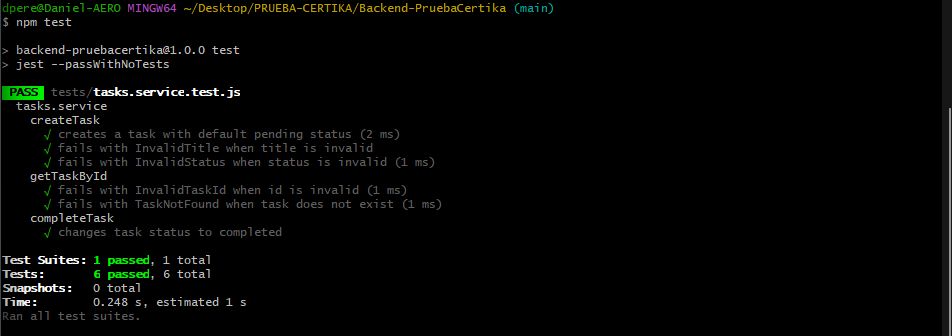
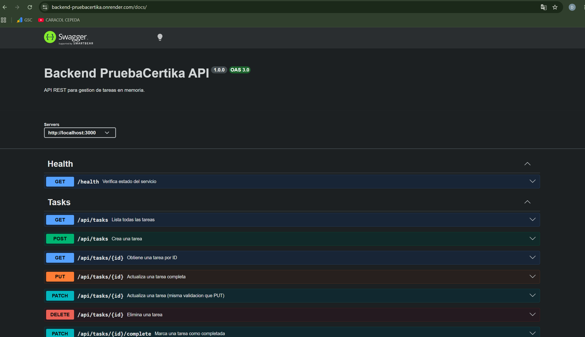

# Backend - Prueba Certika

API REST para gestionar tareas (CRUD) con Node.js + Express.
La persistencia es en memoria, asi que los datos se reinician cuando el servicio se vuelve a levantar.

## Enlaces utiles

- API en produccion (Render): `https://backend-pruebacertika.onrender.com`
- Healthcheck: `https://backend-pruebacertika.onrender.com/health`
- Swagger UI: `https://backend-pruebacertika.onrender.com/docs`
- Base de endpoints: `https://backend-pruebacertika.onrender.com/api/tasks`
- Frontend que consume esta API: `https://frontend-prueba-certika.vercel.app`

## Que incluye este backend

- CRUD completo de tareas.
- Validaciones basicas para `title` y `status`.
- Endpoint de salud (`/health`).
- Documentacion Swagger para probar endpoints desde navegador.

## Correr el proyecto en local

### Requisitos

- Node.js 18 o superior
- npm

### Instalacion

```bash
npm install
```

### Variables de entorno

Crea un archivo `.env` tomando como base `.env.example`.

Ejemplo local:

```env
PORT=3000
CORS_ORIGIN=*
```

### Levantar servidor

Modo desarrollo (con recarga):

```bash
npm run dev
```

Modo produccion:

```bash
npm start
```

Cuando esta corriendo local:

- API: `http://localhost:3000`
- Swagger: `http://localhost:3000/docs`

## Configuracion recomendada en Render (informativa)

Esta seccion es solo de referencia para despliegue en cuenta propia.

En produccion, usa:

```env
CORS_ORIGIN=https://frontend-prueba-certika.vercel.app
```

`PORT` normalmente lo asigna Render automaticamente.

## Endpoints principales

Prefijo: `/api/tasks`

- `POST /api/tasks` crea una tarea.
- `GET /api/tasks` lista tareas.
- `GET /api/tasks/:id` obtiene una tarea por id.
- `PATCH /api/tasks/:id` actualiza titulo/estado.
- `PATCH /api/tasks/:id/complete` marca tarea como completada.
- `DELETE /api/tasks/:id` elimina tarea.
- `GET /health` revisa estado del servicio.

## Tests

```bash
npm test
```

Actualmente cubre logica de la capa `service`, con repositorio mockeado.

## Evidencias (capturas)

Coloca estas imagenes en `docs/evidencias/`:

- `pruebaUnitaria.png`
- `Swagger.png`

### Pruebas unitarias



### Swagger UI



## Checklist rapido antes de entregar

1. **Healthcheck del backend**: abrir `https://backend-pruebacertika.onrender.com/health` y confirmar respuesta `ok`.
2. **Documentacion y pruebas de API (Swagger UI)**: abrir `https://backend-pruebacertika.onrender.com/docs` para visualizar y probar endpoints.
3. **Pruebas CRUD desde Swagger**: ejecutar `POST`, `GET`, `PATCH` y `DELETE` sobre `/api/tasks` y validar respuestas correctas.
4. **Prueba funcional end-to-end (CRUD)**: validar desde el frontend desplegado crear, editar, completar y eliminar tareas.